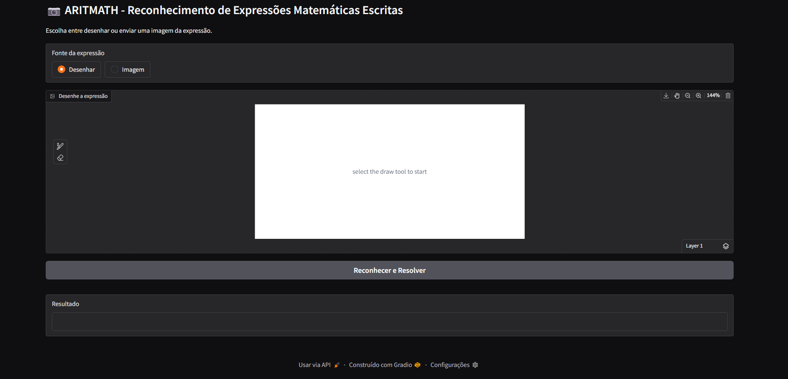
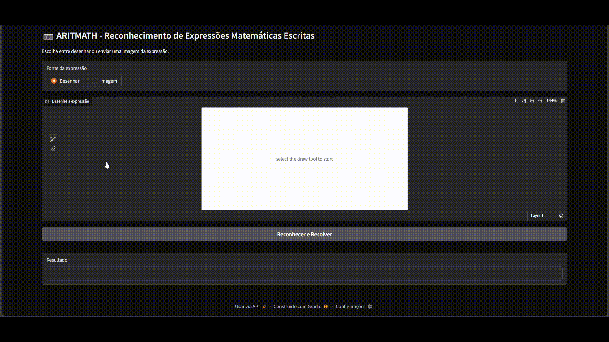

# 📷 ARITMATH

**Resumo:** **ARITMATH** é um sistema interativo capaz de interpretar expressões
aritméticas **manuscritas** a partir de imagens, permitindo ao usuário desenhar
a expressão ou enviar uma imagem, obtendo o resultado da expressão inserida.

---

## 🎯 Objetivo

Nosso objetivo é construir um software que realize a interpretação de expressões
aritméticas manuscritas através de imagens, utilizando técnicas como
Reconhecimento ótico de caracteres (OCR) para reconhecimento de caracteres e
autômatos com expressões regulares para a extração de tokens e validação da
estrutura da expressão, com foco na acessibilidade e integração com outros
sistemas.

---

## 👨‍💻 Tecnologias Utilizadas

- [Python](https://www.python.org/)
- [Gradio](https://gradio.app/) – Interface Web interativa
- [OpenCV](https://opencv.org/) – Processamento de imagem
- [SymPy](https://www.sympy.org/) – Manipulação simbólica de expressões
  matemáticas
- [Transformers (HuggingFace)](https://huggingface.co/) – OCR com TrOCR
- [Modelo TrOCR](https://huggingface.co/fhswf/TrOCR_Math_handwritten) – TrOCR
  para expressões manuscritas
- [Pillow](https://python-pillow.org/) – Manipulação de imagens
- [FastAPI](https://fastapi.tiangolo.com/) – API REST

---

## 🗂️ Estrutura do Projeto

```
├── doc                    # Pasta para armazenar arquivos de documentação
├── api.py                 # API para reconhecimento de expressões (porta 8001)
├── interface.py           # Serviço de interface Gradio (porta 8000)
├── model_downloader.py    # Script para baixar o modelo TrOCR
├── requirements.txt       # Dependências do projeto
├── README.md              # Este arquivo
├── LICENSE                # Licença do projeto
└── .gitignore             # Arquivos ignorados pelo Git
```

---

## ⚙️ Como Executar

### ✅ Rodando Localmente

1. Clone o repositório:

```
git clone https://github.com/renatex314/project_aritmath
cd project_aritmath
```

2. Crie o ambiente virtual e ative:

```
python -m venv venv
source venv/bin/activate   # Linux/Mac
venv\Scripts\activate      # Windows
```

3. Instale as dependências:

```
pip install -r requirements.txt
```

4. Execute o instalador do modelo TrOCR (Apenas pela primeira vez):

```
python model_downloader.py
```

5. Execute a aplicação:

```
python api.py (execute em background ou em outra janela do terminal)
python interface.py (execute em background ou em outra janela do terminal)
```

A aplicação poderá ser acessada no navegador colocando o endereço:
http://127.0.0.1:8000

---

### 🌐 Rodando pela internet

- Acesse pelo link da aplicação no navegador:
  [Aritmath](https://aritmathinterface-749533116403.us-west4.run.app)

---

## 📸 Demonstrações

- Tela inicial:
  

- Exemplo de funcionalidade:
  

- Resultados esperados:

  O modelo utilizado é uma versão do modelo
  [TrOCR](https://huggingface.co/microsoft/trocr-large-stage1) treinado com
  ajuste fino no dataset
  [mathwriting](https://github.com/google-research/google-research/tree/master/mathwriting).
  Sendo assim, de acordo com a documentção do modelo, é esperado os seguintes
  resultados:

  | Métrica                                   | Porcentagem |
  | ----------------------------------------- | ----------- |
  | Reconhecimento totalmente correto         | 77,8%       |
  | Reconhecimento correto com até um erro    | 85,7%       |
  | Reconhecimento correto com até dois erros | 89,9%       |

---

## 👥 Equipe

| Nome          | GitHub                                               |
| ------------- | ---------------------------------------------------- |
| Renato Corte  | [@renatex314](https://github.com/renatex314)         |
| Julia Noronha | [@JulinhaNoronha](https://github.com/JulinhaNoronha) |

---

## 🧠 Disciplinas Envolvidas

- Estrutura de Dados I
- Teoria dos Grafos
- Linguagens Formais e Autômatos

---

## 🏫 Informações Acadêmicas

- Universidade: **Universidade Braz Cubas**
- Curso: **Ciência da Computação**
- Semestre: 7º
- Período: Noite
- Professora orientadora: **Dra. Andréa Ono Sakai**
- Evento: **Mostra de Tecnologia 1º Semestre de 2025**
- Local: Laboratório 12
- Datas: 05 e 06 de junho de 2025

---

## 📄 Licença

MIT License — sinta-se à vontade para utilizar, estudar e adaptar este projeto.
