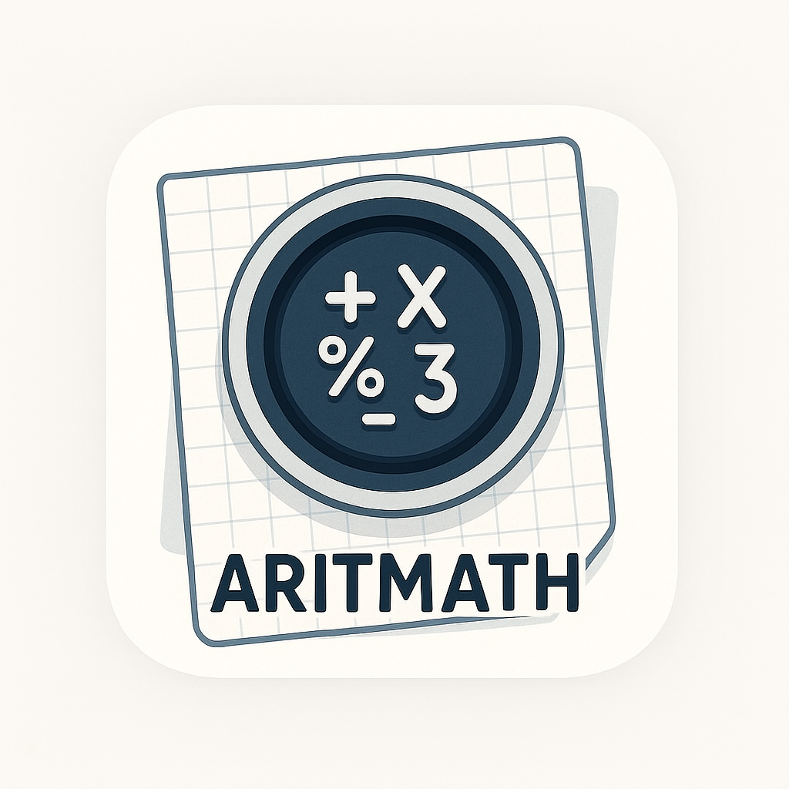

# 📷 ARITMATH



**ARITMATH** é um sistema interativo capaz de interpretar expressões aritméticas
**manuscritas** a partir de imagens, utilizando uma combinação de **técnicas de
Visão Computacional, OCR (Reconhecimento Óptico de Caracteres), Processamento de
Linguagem Natural (NLP)** e **autômatos com expressões regulares**.

O sistema oferece uma interface simples via **Gradio**, permitindo ao usuário
desenhar a expressão ou enviar uma imagem.

---

## ✨ Funcionalidades

- 🖋️ Desenho direto da expressão em um canvas.
- 🖼️ Upload de imagens contendo expressões manuscritas.
- 🔍 Remoção de ruído, correção de inclinação e binarização das imagens.
- 🔠 Reconhecimento de caracteres com
  [TrOCR](https://huggingface.co/fhswf/TrOCR_Math_handwritten).
- 🧠 Interpretação da expressão com SymPy.
- ⚙️ Projeto modular e extensível com foco em **acessibilidade** e **integração
  com outros sistemas**.

---

## 🛠️ Tecnologias Utilizadas

- [Python](https://www.python.org/)
- [Gradio](https://gradio.app/) – Interface Web interativa
- [OpenCV](https://opencv.org/) – Processamento de imagem
- [SymPy](https://www.sympy.org/) – Manipulação simbólica de expressões
  matemáticas
- [Transformers (HuggingFace)](https://huggingface.co/) – OCR com TrOCR
- [Pillow](https://python-pillow.org/) – Manipulação de imagens

---

## 🚀 Como Executar

### 1. Clone o repositório

```bash
git clone https://github.com/renatex314/project_aritmath
cd project_aritmath
```

### 2. Crie e ative um ambiente virtual (opcional, mas recomendado)

```
python -m venv venv
source venv/bin/activate   # Linux/Mac
venv\Scripts\activate      # Windows
```

### 3. Instale as dependências

```
pip install -r requirements.txt
```

### 4. Execute o instalador do modelo TrOCR (Apenas pela primeira vez)

```
python model_downloader.py
```

### 5. Execute a aplicação

```
python api.py (execute em background ou em outra janela do terminal)
python interface.py (execute em background ou em outra janela do terminal)
```

A aplicação estará rodando no endereço: http://127.0.0.1:8000

## 🧪 Exemplo de Uso

<ol>
    <li>Escolha entre "Desenhar" ou "Imagem".</li>
    <li>Desenhe a expressão no quadro ou envie uma imagem.</li>
    <li>Clique em "Reconhecer e Resolver".</li>
    <li>Veja o LaTeX da expressão reconhecida e o resultado computado.</li>
</ol>

## 🧩 Estrutura do projeto

```
├── app.py                 # Script principal com interface Gradio
├── sample.png             # Imagem de exemplo usada por padrão
├── README.md              # Este arquivo
└── requirements.txt       # Dependências do projeto
```

## 📜 Licença

Este projeto está sob a licença MIT.

## 👨‍💻 Autores

Desenvolvido por:

- [Renato Antoniolli Corte](https://github.com/renatex314)
- [Julia Noronha da Silva](https://github.com/JulinhaNoronha)
